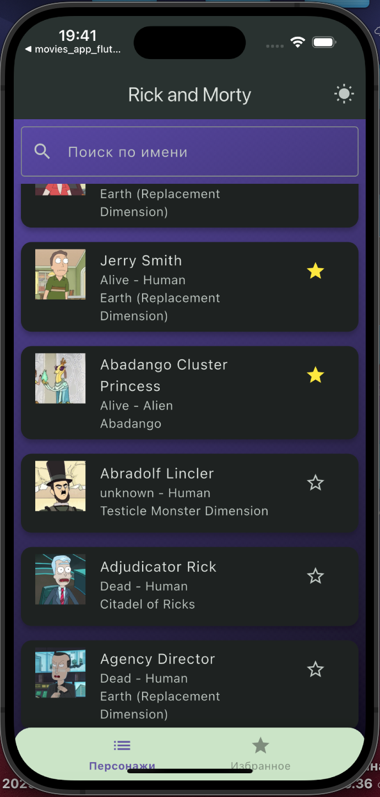
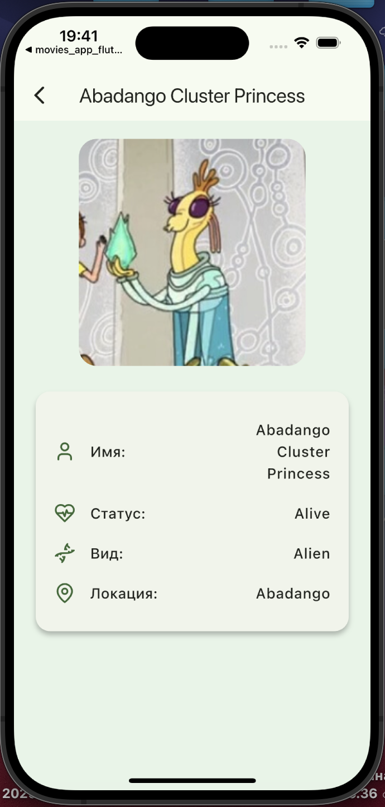
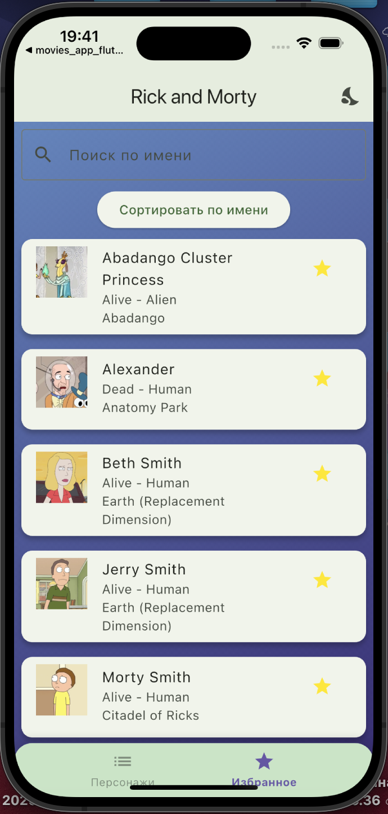

# Rick & Morty Flutter App

Приложение на Flutter, которое загружает персонажей из мультсериала **"Рик и Морти"** с использованием [Rick and Morty API](https://rickandmortyapi.com/). Поддерживает избранное, оффлайн-режим и сортировку.

---

## 📱 Скриншоты






---

## ✨ Возможности

- Загрузка персонажей с публичного API
- Добавление в избранное (и удаление)
- Хранение избранных локально с Hive
- Паггинация
- Локальное сохранения списка, избранных
- Кеширование списка персонажей для оффлайн-доступа
- Поддержка тёмной/светлой темы(анимация для смены темы)
- Плавные анимации при добавлении/удалении избранных
- Анимация заднего фона
- Анимация свапа, смены вкладок
- Сортировка по имени, статусу и т. д.
- Переход на экран персонажа по нажатию на карточку

---

## 📦 Зависимости

- [`provider`](https://pub.dev/packages/provider)
- [`hive`](https://pub.dev/packages/hive) / [`hive_flutter`](https://pub.dev/packages/hive_flutter)
- [`http`](https://pub.dev/packages/http)
- [`path_provider`](https://pub.dev/packages/path_provider) (опционально)

---

## 🛠 Установка и запуск

1. Склонируй репозиторий:

   ```bash
   git clone https://github.com/your-username/rick-and-morty-flutter.git
   cd rick-and-morty-flutter
